# HolyGo Bot 

### YouTube video
https://youtu.be/mVzRRviM7Wk

### UseCase
The HolyGo was created as a browser to search flight ticket. The service is based on SkyScanner REST API and provides searching the flight ticket between cities
including a date. 

SkyScanner API is free service which enable a few endpoints which allow to get information about airports in the city,
flight between cities, dates and prices. Unfortunately, some information shared from SkyScanner are not precise, e.g responses contain dates
but time is always 00.00. 
https://rapidapi.com/skyscanner/api/skyscanner-flight-search?endpoint=5a9c9edde4b084deb4ea6195

### Used services
- Bot Framework Composer
- Bot Framework Emulator
- LUIS
- Adaptive Cards

### Step-by-step
1. Install Bot Framework Composer and Bot Framework Emulator
2. Create new bot from scrach. 
3. Build welcome dialog and add action triggers
4. Build new dialogs based on business logic
5. Create LUIS service on Azure platform
6. Add intents, entities and connect BFC with LUIS service
6. Add HTTP request to SkyScanner API
7. Create Adaptive Cards for HTTP responses
8. Create validation, error handling, exceptions

### Creation process
The first step is creation new bot in Framework Bot Composer. 

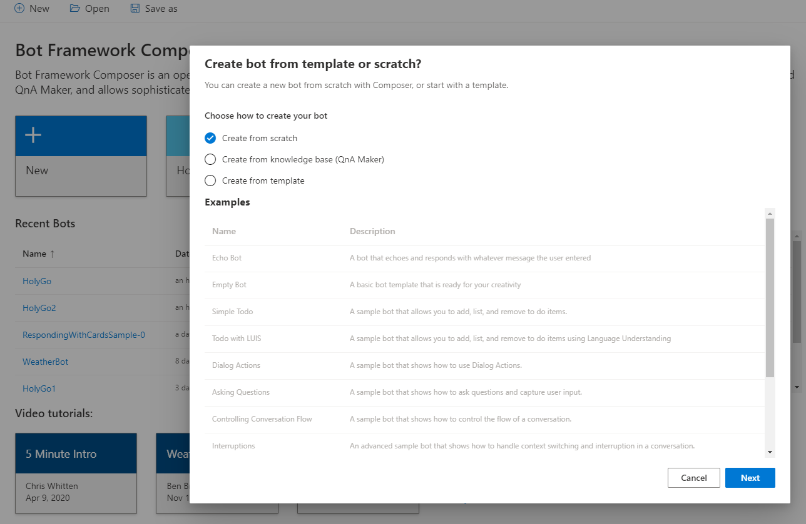

The HolyGo is a main dialog created by default. It contains "Greeting" trigger which is responsible for initialization every new user.

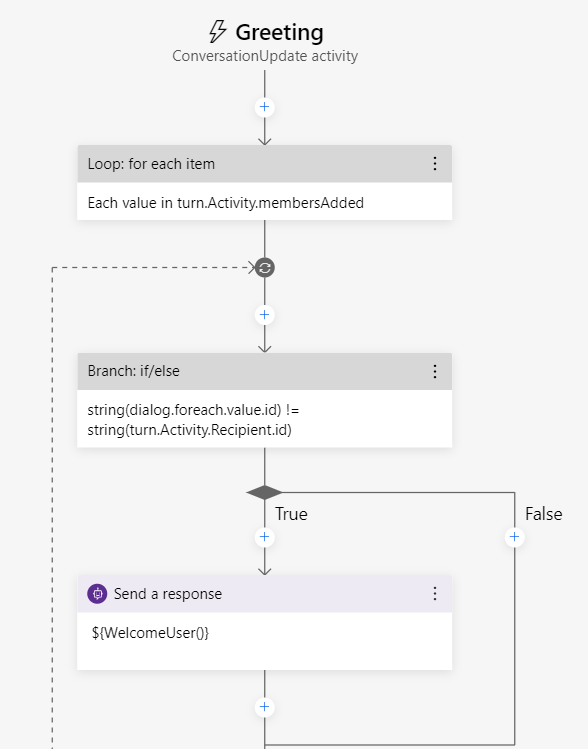

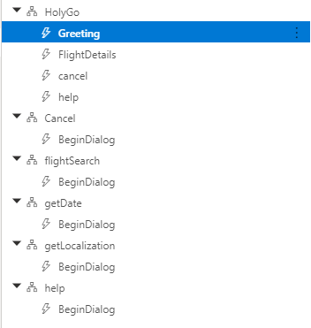

New dialogs are responsible for specific job in service:
- getDate
- getLocalization
- flightSearch
- help
- cancel 

Next step is implementation the dialogs. 

**LUIS**

Below picture presents creating intents and entity from LUIS service for SearchFlight. HolyGo bot has entities of type machine learning what means that LUIS service uses AI to learn from defined utterance to match user phases to proper Intents.

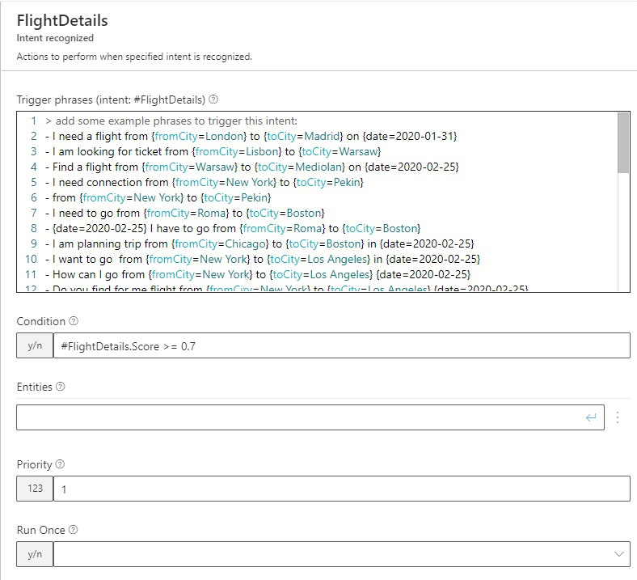

3 entities defined in LUIS service:

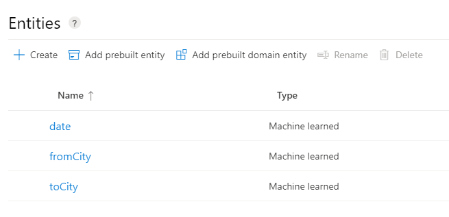

**FlightDetalis.Score >= 0.7** condition means that trigger is pulled only if top-scoring intent gains user-defined level.

**Dialog flightSearch**

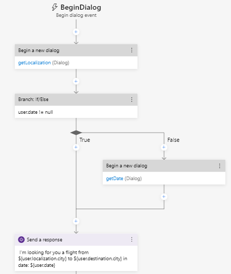

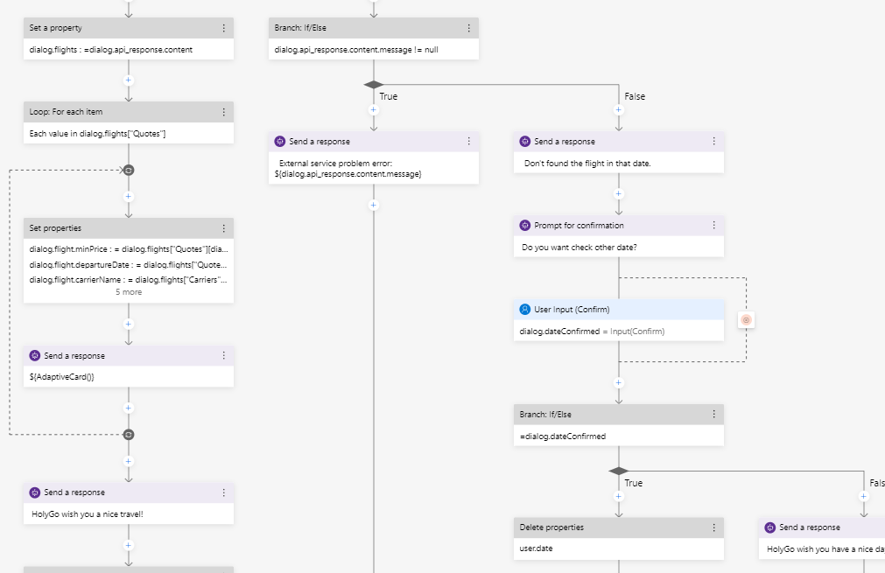

**HolyGo responses**

The Bot Responses tab presents all defined respones for specific dialogs. 

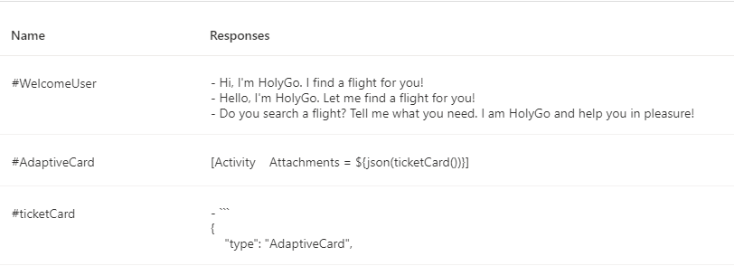  

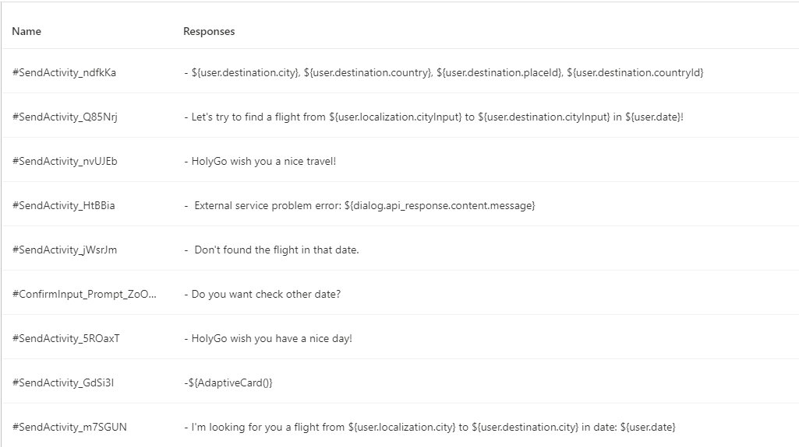

**Error handling**

Below we can see a validation and error handling for user input. An user after typing origin and destination place has to confirmed that the service recognized cities properly. 

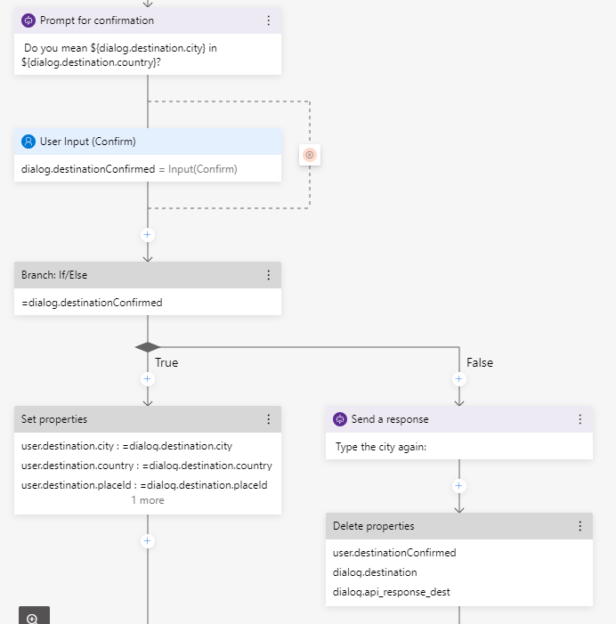

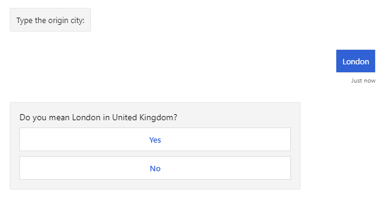

**Adaptive Cards**

The Adaptive Card is used to present the SkyScanner responses. To build cards I used web creator (https://adaptivecards.io/designer/) which is a powerful tool for creating personalize adaptive features.
A code is generated in JSON format and only what is need to do is adding specific variables. 

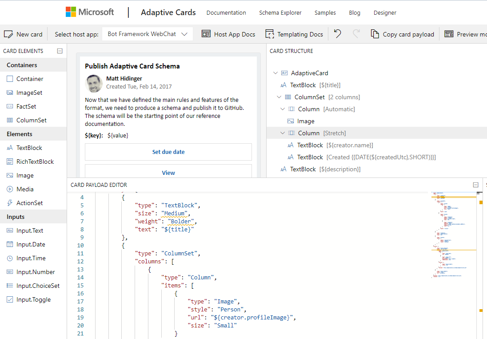

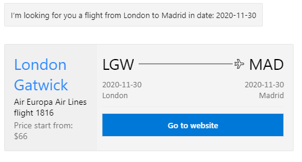

### Resources
- https://docs.microsoft.com/en-us/azure/cognitive-services/luis/luis-concept-patterns
- https://docs.microsoft.com/en-us/azure/bot-service/file-format/bot-builder-lu-file-format?view=azure-bot-service-4.0#roles
- https://adaptivecards.io/designer/
- https://rapidapi.com/skyscanner/api/skyscanner-flight-search?endpoint=5a9c9edde4b084deb4ea6195
- https://www.arafattehsin.com/bot-framework-composer-publish-azure-resources/

