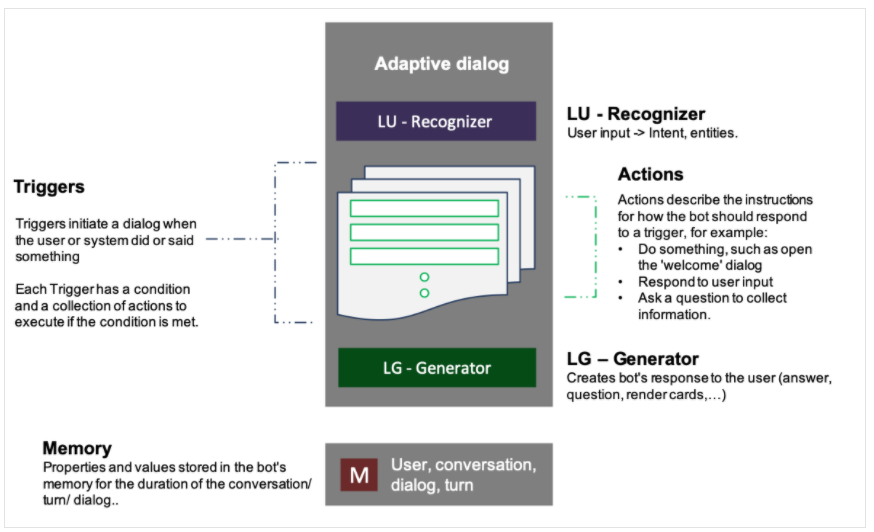

# QnA Maker, Azure Bot Services, Bot Framework Composer

### QnA Maker and Azure Bot Services
#### Intro
OnA Maker service is part of cognitive services enables to creat and publish a knowledge database with built-in natural language processing possibilities.
Knowledge base is a first step in bot creation processing. The service enables to build question-answer model, which is used by a Bot service. The QnA Maker shares the portal
where user can train and test the knowledge base.

Bot service is a second step to build fully functional bot. The service based on the knowledge base created in QnA Maker. User can create bot manually by Microsoft Bot Framework SDK, to write
a custom conversation flow and integrate with QnA Maker, or uses QnA Maker functionality which allow to publish knowledge base as an Azure Bot Service application with just a few clicks.
The service provides extending a bot by writing custom code, configuration logging, analytics and integration with other services.
Moreover, we can interact by a few connection channels like web chat, email, Ms Teams and other communication media using one bot instance.

#### Use Cases
- bot service in website/phone
- medical facilities services
- bot to buy services in delivery company

#### How to

To create a bot it's necessary to have knowledge base based on Questions and Answers.
Let's go to QnA Maker portal.
https://www.qnamaker.ai/Home/MyServices

First step is creating QnAMaker service instance. We can do that easily by Azure platform.
** Attention! Website location must be the same as Azure search location **

After deployment QnAMaker we can finish creating Knowledge base. After adding KB name, add URLs to link to a file with QnA (FAQ) which will be push to the KB.
The possible file format is: https://github.com/MicrosoftDocs/ai-fundamentals/raw/master/data/qna_bot/margies_faq.docx
Service downloads the file, analyses and imports questions and answers automatically!

We can also add chit-chat. Chit-chat is database of typical QnA, which are not useful for our bot probably, but make it more conversational and engaging.
Azure allow to add a few types of chit-chat in a few languages.
Chit-chat types:
- Professional
- Friendly
- Witty
- Caring
- Enthusiastic

Depending on chit-chat type, the answers will be different. We can choose what the bot will be like - more professional or more witty ;)

More about chit-chat: https://docs.microsoft.com/pl-pl/azure/cognitive-services/qnamaker/how-to/chit-chat-knowledge-base?tabs=v1

After creation out KB we can see the result.
To add our own QnA click "+ Add QnA pair".

It's time to train and test the Knowledge base.
At the top click "Save and train" button. After training let's test!
In Inspect tab we can see "Confidence score" what means how sure the answers the algorithm is.

The knowledge base provides a back-end service that client applications (bots) can use to answer questions through some sort of user interface.
The KB must be published to be available be accessed over HTTP.
On the portal we can see the POST Request to QnAMaker instance as a host. We can use it to send question and get answer based on our knowledge base!

After publishing KB in QnA Service we can create Web App Bot.
QnA Auth Key is used to authorize to QnA KB. The key must be the same as we could see after publish QnAMaker.

We need App registration permission to create Ms App. Unfortunately, on student account it's not available :(

_Pricing_

We can use QnAMaker for free with a little constrains:
- Up to 1MB each document
- Up to 100 transactions per minute
- Up to 50,000 transactions per month
- 3 managed documents (FAQ file, .pdt ect) free per month

It's possible to buy a Standard instance which allow use unlimited managed documents - price $8.43
https://azure.microsoft.com/en-us/pricing/details/cognitive-services/qna-maker/

### Bot Framework Composer
#### Intro

Bot Framework Composer is open-source, free application which let quickly build sophisticated conversational bot without writing code.

#### Use case
- bot for internal applications
- insurance calculator
 
#### How to

_Requirements_
- .NET Core 3.1 or later
- Bot Framework Emulator

First step is downloading and installing Bot Framework Composer to your operating system.
After running the app, we can see Home Screen described below:
_On the Home screen, you can create a new bot, open an existing bot on your computer, view some tutorial videos, and also examine some example bots created using the Composer. The Home screen can be accessed at any time by selecting Home from the left navigation bar. Selecting the three lines, or hamburger menu, will expand or collapse the Navigation menu.

The Navigation menu provides options for designing and working on your bot. The Design option opens up the visual designer where you will lay out the conversation and navigation flow of your bot. If you have a bot project open, selecting Navigation* will open the designer for that bot.

Bot Responses is the option where you can view and select the various options that the Composer provides for responding to users. Here you will find common response types such as single or multi-line text options as well as some language generation options that allow you to integrate variables in the response.

User Input provides options for prompting and accepting input from the user as they interact with your bot.

Notifications you can manage the notifications for the bot here.

Publish allows you to manage publishing profiles. Currently, the Composer supports publishing to Azure Functions or Azure Web Apps, both in Preview at this time.

Skills you configure any skills that you want your bot to use. Skills require a Microsoft App ID and a host endpoint.

Settings an editor for the Bot settings, Application settings, and Runtime config options. For example, under Bot settings, you would configure the necessary authoring key and endpoint information for LUIS integration. Perhaps you want to log your bot conversations to a CosmosDB instance on Azure so you would edit the CosmosDB section to include the password, app ID, CosmosDB authKey, collectionId, endpoint, and database ID.

The Application settings portion allows you to configure Composer-specific behaviors. You can select a custom runtime option as well in the Settings for the Composer. We will not cover custom runtime configs._

In Design tab, we can create bot architecture model in graph or code.

A bot architecture is build on a few objects:
- LU Recognizer - the recognizer component is responsible for interpreting what the user wants, based on the input. There are three options for a recognizer, None, LUIS, and Regular Expression. The LUIS recognizer utilizes the language understanding service to understand the user's intent through analysis of the utterance entered by the user. LUIS is the default recognizer if no other is selected. The regular expression type will use industry standard regex formulations to determine the user's intent.
- Trigger - Once a message is processed in the input and the recognizer, the intent and entity values are passed onto triggers. Intents are values that represent a user intention such as BookFlight of GetWeather. Entity values are key data aspects of the utterances (phrases) that a user enters. Triggers contain rules that direct the bot's actions for processing incoming messages. Triggers also help direct the bot behavior and are used for situations where users request help or you need to handle custom events.
- Intent triggers - An intent is either a recognized intent or an unknown intent. The incoming message is passed to the recognizer and either the intent is detected or it is unknown. If the intent is recognized, it gets passed to the trigger, along with any entities contained in the message and the trigger dictates the action(s) to take. If the intent is unknown, then an Unknown intent trigger is fired. The logic in the Unknown intent trigger is designed to handle unknown intents.
- Dialog events - The base type of triggers are dialog triggers. Almost all events start as dialog events that are related to the "lifecycle" of the dialog. Currently there are four different dialog events triggers in Composer:

  Dialog started (Begin dialog event)
  Dialog canceled (Cancel dialog event)
  Error occurred(Error event)
  Reprompt for input(Reprompt dialog event)
  Most dialogs include a trigger configured to respond to the BeginDialog event, which fires when the dialog begins. It allows the bot to respond immediately.

  You use dialog triggers to:

  Take actions immediately when the dialog starts, even before the recognizer is called.
  Take actions when a "cancel" signal is detected.
  Take actions on messages received or sent.
  Evaluate the content of the incoming activity.

- Activities - Typical activities are when a user joins a conversation with a bot. The Greeting activity is an example and is realized through the ConversationUpdate activity. You use activities for the following scenarios:

 A new conversation is started with the bot
 Take action on receipt of any of these activity types: EndOfConversation, Event, HandOff, Invoke, Typing
 Take action on message activity such as: MessageReceived, MessageUpdated, MessageDelete, or MessageReaction

- Custom Events - Custom events are created by you to handle non-default conditions or to control an action associated with a trigger. Custom events are not covered in this content.

Using defined components user can create advanced bot. Bot Framework Composer allow support no-code implementation.
Bot Framework Emulator is a great tool which allow to test our bot in local environment really fast. Just click "test in Emulator" in Composer app to start testing.
Bot Framework Composer support also LUIS service, which make a bot more sophisticated. Of course, LUIS service must be implemented properly to cooperate with a bot.

 _Pricing_
 
Bot Framework Composer is open-source, free application.
  
### Recap
To sum up, Azure platform provides great tools to create a bot based on AI. In easy way, we can integrate the bot with other cognitive services building advance and powerful tool for many uses.
User can use Web App Bot to build web bot with access by API.

