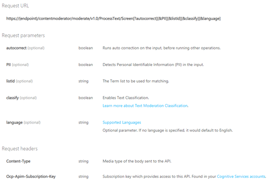
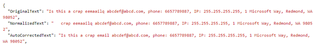
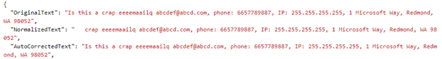
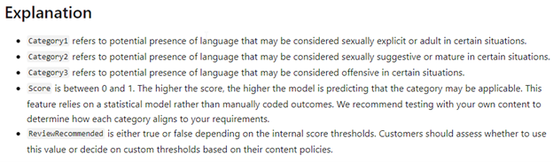
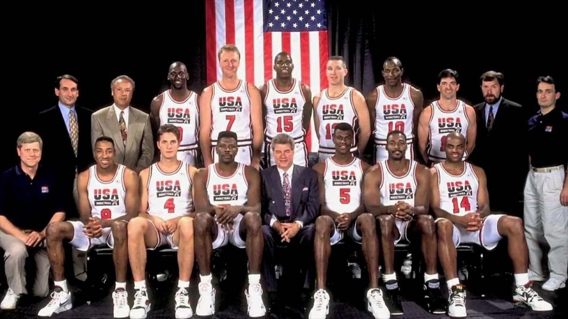

# Cognitive Services

### Content Moderator 
#### Intro
Serwis sluzy do przetwarzania tekstu/obrazu/wideo w celu analizy tresci. Analiza odnosi sie sprawdzenia czy tresci zakwalifikuja sie do potencjalnie zakazanych, wulgarnych, rasistowskich. 
Klasyfikacja opiera sie na mechanizmach uczenia maszynowego, czarnych list (ang. Blacklist) oraz optycznego wykrywania obiektow. Serwis analizuje rowniez tresci pod katem danych osobowych/wrazliwych. Potrafi nam je wskazac w przeslanym tekscie i okreslic ich typ. 

Mozemy stworzyc swoja liste slow/wyrazen zakazanych lub bazowac na bazie przygotowanej przez MS dla danego jezyka. Serwis obsluguje ponad 100 jezykow. 
#### Use Cases
- filtracja teksu/zapytania przesylanego do bota przez klienta
- filtracja tresci publikowanych na forach/ portalach spolecznosciowych 
- analizowania tresci pod katem obrazliwych
- analiza pod katem danych wrazliwych 

#### How to

_Ograniczenia_
- Mozemy stworzyc maksymalnie 5 list wyrazen zakazanych, po 10'000 wyrazez w kazdej z nich. 
- Przeslany tekst do analizy moze zawierac do 1024 znakow.
- Przesylane obrazy musza zawierac min. 128 pixeli a ich rozmiar max. 4mb

_Uzycie_ 

Tworzymy swoja instancje serwisu, wpisujac odpowiednie dane i wybierajac wersje subskrypcji. Zostaje nam udostepnione REST, ktorego mozemy wysylac swoje zapytania. Uzywajac odpowiednich endpoint'ow odwolujemy sie do konkretnych funkcjonalnosci serwisu. 
Microsoft udostepnia strone, na ktorej mozemy testowac serwis: https://westus.dev.cognitive.microsoft.com/docs/services/57cf753a3f9b070c105bd2c1/operations/57cf753a3f9b070868a1f66f
Wybieram region geograficzny w ktorym sie znajdujemy oraz podajac klucz naszej instancji, mozemy testowac cala funkcjonalnosc API. 
W polu Header zapytania musimy zawrzec Contetn-Type, czyli powiedziec usludze w jakim formacie przesylamy tresci do filtrowania. Mamy dostepne 4 typy: 
 
Lista parametrow:

 
Ponize przedstawie przyklady kilku z mozliwosci, ktore daje nam Content Moderator. 

**_Screen_**

Korzystajac z funkcjonalnosci ,,Screen" mozemy uzyskac autokorekte wysylanych tresci. Mozemy w parametrach zapytania wybrac jezyk, w ktorym wysylamy dane, lecz nie jest to wymagane, bo usluga potrafi samodzielnie wykryc jezyk tresci.
Ponizej prezentuje pozytywne zadzialanie autokorekty: 

 
Oraz nieudane:

 
Dostepna jest opcja wykrywania danych personalnych (PII) jak: email, numer telefonu, adres, adresy IP.
Mozemy skorzystac z opcji Classify w celu klasyfikacji danych do 3 grup opisanych ponizej: 

 
Przeslane tresc jest klasyfikowana do kazdej grupy na podstawie punktacji od 0 do 1, gdzie kierunek 0 oznacza niskie dopasowania a kierunek 1 wysokie dopasowanie. 
Find Faces
Po testach wykrywania twarzy na obrazie, okazuje sie, ze algorytm myli sie nawet przy niezbyt wymagajacych zdjeciach. 
Po przeslaniu zdjecia przedstawionego ponizej:

 
Serwis wykryl 16 twarzy. 

Przy blizszych ujeciach, np. typu selfie, algorytm poprawnie wykryl ilosc osob. 
Serwis nie reaguje na emotikony. 

Serwis umozliwia skorzystanie rowniez z innych funkcjonalnosci:
- Evaluate - analiza obrazu pod katem tresci obrazliwych lub przeznaczonych dla doroslych
- Match - do pasowania obrazu ze listy obrazow przygotowanych prze uzytkownika
- OCR - Odczytanie teksu ze zdjecia

_Oplaty_
 
Mozemy skorzystac z darmowej wersji serwisu, pozwalajacej na przyslanie jednego zapytania na sekunde lub skorzystac z platnej wersji, ktora pozawala na 10 zapytan na sekunde. 
W cene wlicza sie rowniez ilosc zapytan - cena spada ze wzrostem zamowienia.
(https://azure.microsoft.com/en-us/pricing/details/cognitive-services/content-moderator/)

 

