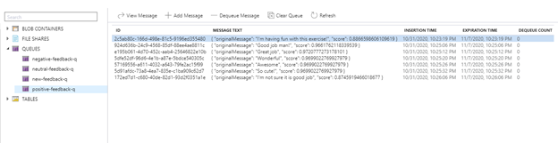

# Cognitive Services

### Content Moderator 
#### Intro
Serwis sluzy do przetwarzania tekstu/obrazu/wideo w celu analizy tresci. Analiza odnosi sie sprawdzenia czy tresci zakwalifikuja sie do potencjalnie zakazanych, wulgarnych, rasistowskich. 
Klasyfikacja opiera sie na mechanizmach uczenia maszynowego, czarnych list (ang. Blacklist) oraz optycznego wykrywania obiektow. Serwis analizuje rowniez tresci pod katem danych osobowych/wrazliwych. Potrafi nam je wskazac w przeslanym tekscie i okreslic ich typ. 

Mozemy stworzyc swoja liste slow/wyrazen zakazanych lub bazowac na bazie przygotowanej przez MS dla danego jezyka. Serwis obsluguje ponad 100 jezykow. 
#### Use Cases
- filtracja teksu/zapytania przesylanego do bota przez klienta
- filtracja tresci publikowanych na forach/ portalach spolecznosciowych 
- analizowania tresci pod katem obrazliwych
- analiza pod katem danych wrazliwych 

#### How to

_Ograniczenia_
- Mozemy stworzyc maksymalnie 5 list wyrazen zakazanych, po 10'000 wyrazez w kazdej z nich. 
- Przeslany tekst do analizy moze zawierac do 1024 znakow.
- Przesylane obrazy musza zawierac min. 128 pixeli a ich rozmiar max. 4mb

_Uzycie_ 

Tworzymy swoja instancje serwisu, wpisujac odpowiednie dane i wybierajac wersje subskrypcji. Zostaje nam udostepnione REST, ktorego mozemy wysylac swoje zapytania. Uzywajac odpowiednich endpoint'ow odwolujemy sie do konkretnych funkcjonalnosci serwisu. 
Microsoft udostepnia strone, na ktorej mozemy testowac serwis: https://westus.dev.cognitive.microsoft.com/docs/services/57cf753a3f9b070c105bd2c1/operations/57cf753a3f9b070868a1f66f
Wybieram region geograficzny w ktorym sie znajdujemy oraz podajac klucz naszej instancji, mozemy testowac cala funkcjonalnosc API. 
W polu Header zapytania musimy zawrzec Contetn-Type, czyli powiedziec usludze w jakim formacie przesylamy tresci do filtrowania. Mamy dostepne 4 typy: 
 
Lista parametrow:

 
Ponize przedstawie przyklady kilku z mozliwosci, ktore daje nam Content Moderator. 

**_Screen_**

Korzystajac z funkcjonalnosci ,,Screen" mozemy uzyskac autokorekte wysylanych tresci. Mozemy w parametrach zapytania wybrac jezyk, w ktorym wysylamy dane, lecz nie jest to wymagane, bo usluga potrafi samodzielnie wykryc jezyk tresci.
Ponizej prezentuje pozytywne zadzialanie autokorekty: 

 
Oraz nieudane:

 
Dostepna jest opcja wykrywania danych personalnych (PII) jak: email, numer telefonu, adres, adresy IP.
Mozemy skorzystac z opcji Classify w celu klasyfikacji danych do 3 grup opisanych ponizej: 

 
Przeslane tresc jest klasyfikowana do kazdej grupy na podstawie punktacji od 0 do 1, gdzie kierunek 0 oznacza niskie dopasowania a kierunek 1 wysokie dopasowanie. 
Find Faces
Po testach wykrywania twarzy na obrazie, okazuje sie, ze algorytm myli sie nawet przy niezbyt wymagajacych zdjeciach. 
Po przeslaniu zdjecia przedstawionego ponizej:

 
Serwis wykryl 16 twarzy. 

Przy blizszych ujeciach, np. typu selfie, algorytm poprawnie wykryl ilosc osob. 
Serwis nie reaguje na emotikony. 

Serwis umozliwia skorzystanie rowniez z innych funkcjonalnosci:
- Evaluate - analiza obrazu pod katem tresci obrazliwych lub przeznaczonych dla doroslych
- Match - do pasowania obrazu ze listy obrazow przygotowanych prze uzytkownika
- OCR - Odczytanie teksu ze zdjecia

_Oplaty_
 
Mozemy skorzystac z darmowej wersji serwisu, pozwalajacej na przyslanie jednego zapytania na sekunde lub skorzystac z platnej wersji, ktora pozawala na 10 zapytan na sekunde. 
W cene wlicza sie rowniez ilosc zapytan - cena spada ze wzrostem zamowienia.
(https://azure.microsoft.com/en-us/pricing/details/cognitive-services/content-moderator/)

### Language Understanding Intelligent Service (LUIS) 

#### Intro

Language Understanding Intelligent Service (LUIS) sluzy do dopasowwywania tresci do stowrzonych przez uzytkowniaka grup tematycznych na podstawie wytycznych podanych przez uzytkownika. Serwis sprawdza sie przy tworzeniu bot'ow do konwersacji opartych na sztucznej inteligencji. Serwis pozawala na uczenie bota, na podstawie wprowadzonych danych oraz sortowania tresci do odpowiednich grup tematycznych. 

#### Use Case

- uzywane przy tworzeniu inteligentnych botow na stronach linii lotniczych, sklepow itp.
- w polaczeniu z serwisem czytajacym mowe, mozna stworzyc urzadzenie sterowane glosem
- interfejsy komunikacji czlowiek-komputer 
#### How To

_Uzycie_

LUIS jest serwisem opartym na uczeniu maszynowym. Uzytkownik nie musi znac tych zagadnien, aby je wykorzystac - serwis robi to w imieniu uzytkownika! 
Dzialanie serwisu opiera sie na przetwarzaniu 3 glownych obiektow:
- **Utterances:** tresc wejsciowa, to co przysylamy do serwisu 
- **Intents:** grupa tematyczna, do ktorej moze zaliczyc sie przeslana tresc
- **Entities:** slowa lub wyrazenia poszukiwane w Utterance, w celu dopasowania tresci wejsciowej do danej grupy tematycznej

Dzialanie polega na analizie tresci przysylanych do serwisu, na podstawie slow/wyrazen kluczowych podanych wczesniej przez uzytkownika i dopasowaniu ich do odpowiedniej grupy tematycznej (Intents). Mechanizm bedzie dopasowywal tresci na tyle dobrze, na ile damy mu danych do nauki - tzn., ile Entities okreslimy dla kazdej z grup tematycznych.

_Oplaty_

Z LUIS mozna skorzystac wykorzystujac subskrypcje darmowa, pozwalajaca na 5 zapytan tekstowych/sekunde przez pierwsze 10'000 transakcji w miesiacu (po przekroczeniu serwis zwolni do 2 zapytan/sekunde) lub wersje platna 50 zapytan tekstowych/sekunde w cenie 1.27 euro za 1000 zapytan. Mozliwe jest rowniez wysylanie zapytan glosowych przy wykupieniu platnej subskrypcji. 

### Text Analytics
#### Intro

Serwis sluzy do analizy teksu. Pozwalana na ocene charakteru emocjonalnego przeslanych tresci (pozytywne, negatywne, neutralne). Serwis udostepnia takze funkcje wykrywania jezyka oraz wyszukiwania slow kluczowych. Serwis opiera swoje dzialanie o uczenie maszynowe. 

#### Use case
 - analiza opinii uzytkownikow sklepow, uslug itp.
 - przekierowywania ogloszen do odpowiedniego oddzialu w firmie miedzynarodowej 
 - tagowanie wiadomosci w oparciu o slowa kluczowe 
 - oznaczenia komentarzy na portalach spolecznosciowych 
 
#### How to 

_Ograniczenia_
- Dostepne jezyki:
 https://docs.microsoft.com/en-us/azure/cognitive-services/text-analytics/language-support?tabs=sentiment-analysis
- W jednym dokumencie mozemy przeslac max. 1'000 dokumentow, po 5'000 znakow w kazdym.
 
_Uzycie_
 
Ponizej przedstawiam tylko jedna z funkcjonalnosci udostepnianych przez ten serwis.

**Sentiment Analysics**

Wysylajac tekst do analizy do serwisu, algorytm oparty na uczeniu maszynowym, potrafi okreslic nam stan emocjonalny wypowiedzi w skali od 0 do 1. Czym wynik blizszy 1 tym emocje wypowiedzi okreslane sa na bardziej pozytywne - blizej 0, bardziej negatywne. Wynik okolo 0.5 wskazuje na neutralny charakter wypowiedzi. 
Aby skorzystac z serwisu, wystarczy wyslac zapytanie http na odpowiedni endpoint, a algorytm okresli stan emocjonalny przeslanej tresci. 
Przechodzac przez tutorial udalo sie stworzyc Function App , ktora pozwala na umieszczenie przeslanych tresci w 1 z 3 grup, po przepuszczeniu tresci przez Sentiment Analytics.

Schemat aplikacji: 

  
Ponizej przedstawiam zdjecie z panelu Monitor aplikacji pokazujacego historie transakcji.

  
Ponizej pokazano zawartosc kolejki positive-feedback.

  
Co warto zapamietac przy tworzeniu kolejek w Storage Account/Storage Explorer/Queue - wystarczy utworzyc kolejki wyjsciowe. Kolejki do ktorych trafiaja zapytania (direction = out) utworza sie automatycznie po trafieniu tam pierwszej tresci. 
 
_Oplaty_

https://azure.microsoft.com/en-us/pricing/details/cognitive-services/text-analytics/
Usluga oferuje darmowa subskrypcje do 5'000 transakcji na miesiac. 
Mozna rowniez wykupic jedna z platnych wersji przedstawiona ponizej. 

  
### Podsumowanie
Opisane serwisy naleza do pakietu Cognitive Services MS Azure. Dzieki zastosowaniu AI potrafia analizowac przeslane im tresci, co mozna wykorzystac do stworzenia bota czy wzbogacenia swojej aplikacji. 
Serwisy oferuja darmowe oraz platne subskurpcje, ktore mozna dopasowac w zaleznosci od zapotrzebowania. 

