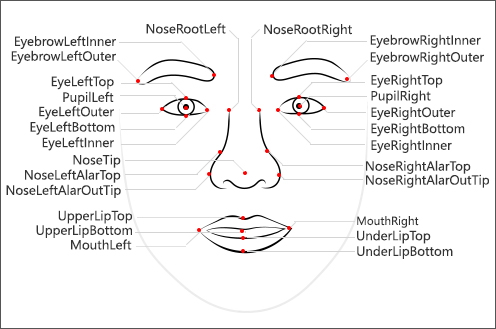
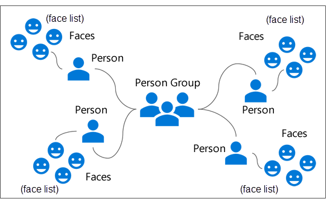
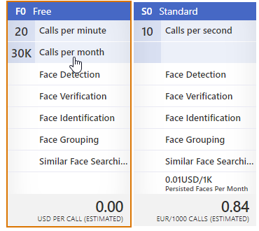
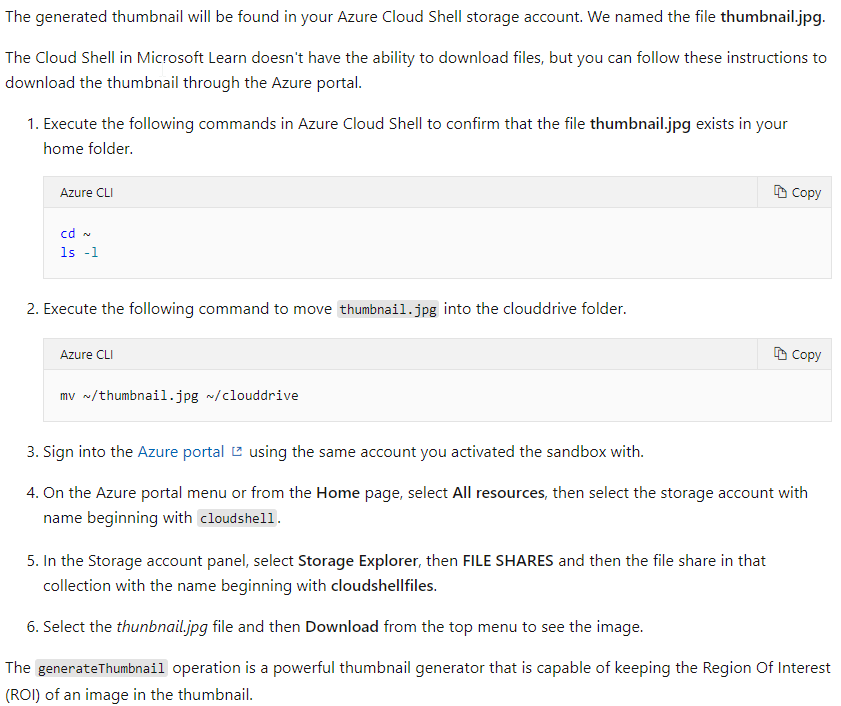
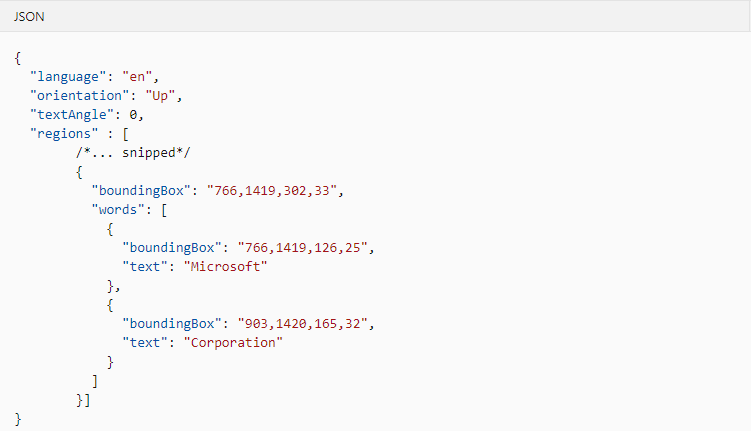
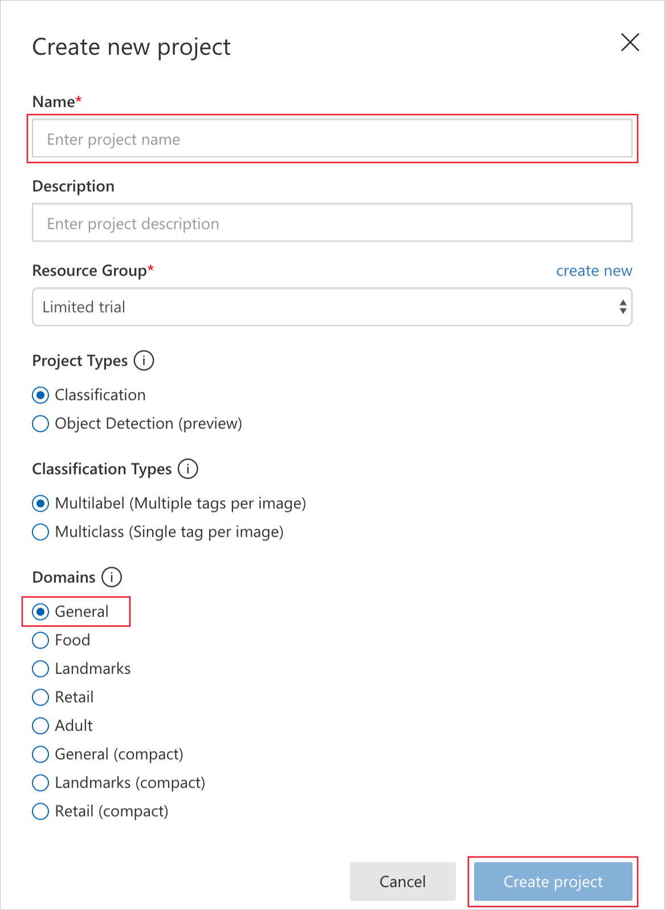
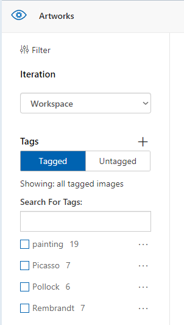
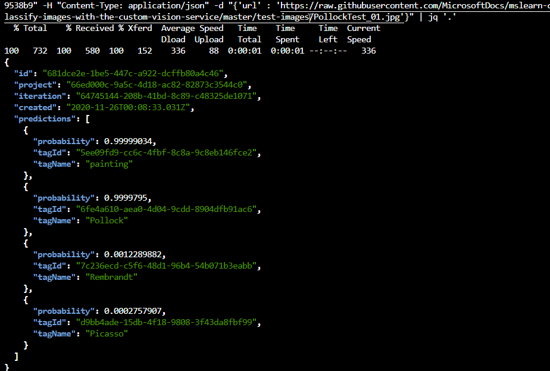

# Vision Services

#### Intro

Tutorial: https://docs.microsoft.com/en-us/learn/modules/identify-faces-with-computer-vision/1-introduction

The Computer Vision API provides algorithms to process images and return insights.
Computer Vision service provides face recognition, matching and define face attributes. The Face API can also organize people and facial definitions into groups to locate similar faces.

The Face API tasks fall into five categories:
- **Verification**: Check the likelihood that two faces belong to the same person.
- **Detection**: Detect human faces in an image.
- **Identification**: Search and identify faces.
- **Similarity**: Find similar faces.
- **Grouping**: Organize unidentified faces into groups, based on their visual similarity.

The Face API uses artificial intelligence to:

- Detect human activity in images.
- Attempt to match faces to existing image databases.
- Detect human faces and return their coordinates.
- Manage profiles based on face attributes.
- Analyze and identify faces in video frames.

The Face API provides methods to detect human faces in images and can return face locations, landmarks, and attributes:

- **Locations**: In the image that includes a face, the Face API finds the top, left, width, and height coordinates of the face region.
- **Landmarks**: The Face API finds the position of common face elements, such as pupils, nose, and lips.
- **Attributes**: The Face API estimates face attributes such as age, gender, hair color, smile, facial hair, glasses, and emotion.

_Landmarks_
Face landmarks are a collection of detailed points on a face. These points identify common facial elements such as a pupil, nose, or eyebrow by using pixel coordinates.
The Face API can return up to 27 landmarks for each identified face that you can use for analysis.

_Attributes_
Face attributes are predefined properties of a face or a person represented by a face. The Face API can optionally identify and return the following types of attributes for a detected face:
- Age
- Gender
- Smile intensity
- Facial hair
- Head pose (3D)
- Emotion

##### Face detection
The face detection API provides information about detected faces in an image, but isn't designed to identify or recognize a specific face. However, the Face API provides this capability through a Facial recognition API.
Facial recognition is used in many areas, including security, natural user interfaces, image analysis, mobile apps, and robotics.

Facial recognition builds on the facial detection API by analyzing the landmarks in two or more pictures to determine if the same face is present. There are four aspects which can be determined through this analysis.

1. Do two images of a face belong to the same person? This defines verification.
2. Does this person look like other people? This defines similarity.
3. Do all of these faces belong together? This defines grouping.
4. Who is this person in this group of people? This defines identification.

Strictly speaking, a face list is a group of faces. Create and manage face lists to find similar faces in a fixed collection of faces. For example, you could use a face list to find a similar face in a set of pictures of celebrities, friends, or family members.

A face list relates to several concepts:

- Face: A single face
- Face list: A list or collection of faces
- Person: A single person
- Person group: A list or collection of persons

#### Use Cases
- guard system in industry
- examination of people emotion on mass events 
- searching a person from plenty of photos

#### How to

_**Constrains**_

Service allow to collect:
- **Face list**: Up to 1,000 distinct faces
- **Person group**: Up to 10,000 persons
- **Person**: Up to 248 faces

The image can be in one of the following formats:
- A binary file, such as a stream or byte array
- A JSON payload that includes the value of a publicly available image URL, formatted as human-readable text

To use the service it's necessary to create Face API service in Azure Portal. 
The service provides REST API to send payload to analyse. All we need is service endpoint and key. 

A test of all service features, format of request, endpoints we can find here: 
https://westus.dev.cognitive.microsoft.com/docs/services/563879b61984550e40cbbe8d/operations/563879b61984550f30395236

_**Pricing**_

We can choose 2 types of subscriptions: 

https://azure.microsoft.com/en-us/pricing/details/cognitive-services/face-api/

#Computer Vision

Tutorial: https://docs.microsoft.com/en-us/learn/modules/create-computer-vision-service-to-classify-images/5-extract-printed-text

### Intro 

You can use the Computer Vision API to:
- Analyze images for insight
- Extract printed text from images using optical character recognition (OCR).
- Recognize printed and handwritten text from images
- Recognize celebrities and landmarks
- Analyze video
- Generate a thumbnail of an image

##### OCR (Optical Character Recognition)

The ocr operation detects text in an image and extracts the recognized characters into a machine-usable character stream.
The call accepts two optional parameters:

- language: The language code of the text to be detected in the image. The default value is unk,or unknown. This let's the service auto detect the language of the text in the image.
- detectOrientation: When true, the service tries to detect the image orientation and correct it before further processing, for example, whether the image is upside-down.

##### Handwritten text

The service allow to detect handwritten text. The recognizeText operation detects and extracts handwritten text from notes, letters, essays, whiteboards, forms, and other sources

### How to

You call Computer Vision in your application using client libraries or the REST API directly.

Format the URL as follows: region.api.cognitive.microsoft.com/vision/v2.0/resource/[parameters]

region - the region where you created the account, for example, westus.
resource - the Computer Vision resource you are calling such as analyze, describe, generateThumbnail, ocr, models, recognizeText, tag.
You can supply the image to be processed either as a raw image binary or an image URL.

The request header must contain the subscription key, which provides access to this API.

All operations on the Computer Vision API have the following restrictions when it comes to the images you ask it to process:

- Supported image formats: JPEG, PNG, GIF, BMP.
- Image file size must be less than 4 MB.
- Image dimensions must be at least 50 x 50.

##### OCR
BTW it's a way to get files from Azure Cloud Shell: 

In JSON response we get:
- language (from auto-detect mechanism)
- orientation (text orientation)
- text angle
- regions
- The four integers of the boundingBox value are:
  - the x-coordinate of the left edge
  - the y-coordinate of the top edge
  - the width of the bounding box
  - the height of the bounding box,

##### Handwritten text

If present, the mode parameter must be set to Handwritten or Printed and is case-sensitive.
If the parameter is set to Handwritten or is not specified, handwriting recognition is performed. If the parameter is set to Printed, then printed text recognition is performed.
The time it takes to get a result from this call depends on the amount of writing in the image.

_**Pricing**_

https://azure.microsoft.com/en-us/pricing/details/cognitive-services/computer-vision/

# Custom Vision portal 

Tutorial: https://docs.microsoft.com/en-us/learn/modules/classify-images-with-custom-vision-service/

### How to 

Custom Vision UI portal: https://www.customvision.ai

Steps:
1. Create new project on CustomVision portal.
2. Set proper Classification Types and Domain.

3. Create tags.

4. Upload images and set proper tags to them.
5. Train model.
6. Test the model using "Quick Test".
7. In prediction tab, we can set tags to images we have tested to refine the model without uploading additional training images.
8. Publish model (Performance tab -> Publish -> Prediction URL).
9. Use HTTP request to get image's prediction.

_**Pricing**_

2 types of subscriptions (Free and Standard):

https://azure.microsoft.com/en-us/pricing/details/cognitive-services/custom-vision-service/

# Video Indexer

https://docs.microsoft.com/en-us/learn/modules/extract-insights-from-videos-with-video-indexer-service/1-introduction

Azure Video Indexer is a service to extract insights from media. It uses machine learning models that can be further customized and trained. The video insights include face identification, text recognition, object labels, scene segmentations, and more. Additional insights are extracted from audio, such as transcription and emotion detection. You can use these results to improve search, extract clips, create thumbnails, and more.

### How to

_**Constrains**_
- You also want to be aware of upload limits. If you are using a trial account, you may upload five videos per minute. For a paid account, the limit is 50 per minute.

Api:
https://api-portal.videoindexer.ai/docs/services/Operations/operations/Cancel-Project-Render-Operation

Video Indexer Developer Portal:
https://api-portal.videoindexer.ai

Extracting insights from videos starts with uploading and indexing the videos. Azure Video Indexer provides several options for uploading videos: upload from URL, send file as byte array, or reference existing asset ID. Many file formats are supported including WMV, MOV, MPG, and AVI. Once the video is uploaded, the indexing process starts automatically. Once completed, you can examine the indexer results.

_**Key aspects**_

Video indexer identifies temporal segments within the video to improve how you browse and edit indexed videos. The key aspects are extracted based on changes in color, contrast, and other semantic properties.
The detected segments are organized as a hierarchy. Video Indexer processes the video file into one or more scenes. Each scene is made up of one or more shots. Within the shot, keyframes are determined.

**Scene**
A scene represents a single event within the video. It groups consecutive shots that are related. It will have a start time, end time, and thumbnail (first keyframe in the scene).

**Shot**
A shot represents a continuous segment of the video. Transitions within the video are detected which determine how it is split into shots. Shots have a start time, end time, and list of keyframes.

**Keyframe**
Keyframes are frames that represent the shot. Each one is for a specific point in time. There can be gaps in time between keyframes but together they are representative of the shot. Each keyframe can be downloaded as a high-resolution image.

_**Pricing**_

https://azure.microsoft.com/en-us/pricing/details/media-services/
